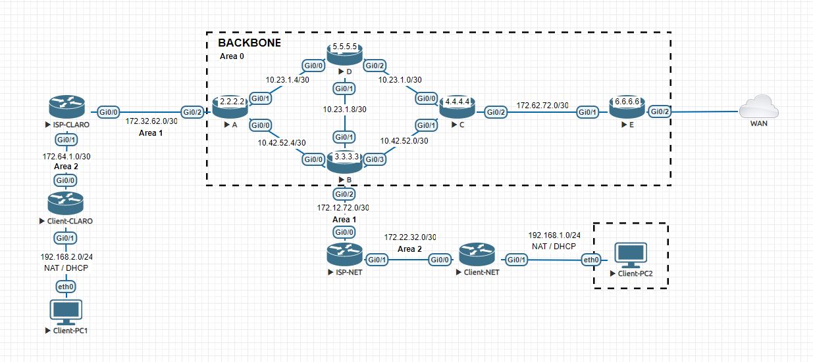

# OSPF Multiárea e Redundância de Links
## Descrição do Projeto
Este projeto tem como objetivo configurar um ambiente de rede utilizando o protocolo de roteamento dinâmico OSPF (Open Shortest Path First) em um cenário multiárea e garantir a resiliência da rede através da implementação de redundância de links. A configuração inclui a criação de áreas OSPF distintas e a configuração da área backbone (Área 0) para conectar todas as outras áreas.

Além disso, foi realizada uma simulação para testar a redundância de links dentro da área backbone (Área 0), verificando o comportamento da rede em caso de falha dos links. O teste envolveu a desativação de uma interface crítica para simular uma falha real. Durante o failover, o OSPF detectou automaticamente a falha e ajustou as rotas, redirecionando o tráfego pelos links alternativos configurados. Esse processo garantiu a continuidade da conectividade e a manutenção do desempenho da rede, demonstrando a eficácia da configuração de failover e a capacidade do OSPF de fornecer alta disponibilidade e resiliência contra falhas de rede.

## Topologia da Rede

A topologia da rede consiste em três áreas OSPF:
- Área 0 (Backbone): Centraliza o roteamento e interconecta as outras áreas.
- Área 1: Conecta os roteadores `ISP-NET` e `ISP-CLARO` à Área 0.
- Área 2: Conecta os clientes nas redes `192.168.1.0/24` e `192.168.2.0/24` através dos roteadores `Client-NET` e `Client-CLARO`.
## Configurações Importantes
1. OSPF Multiárea:

- As áreas OSPF foram configuradas conforme a topologia.
- As rotas foram redistribuídas entre as áreas para garantir conectividade total.
2. NAT:

- Configurado nos roteadores (Client-CLARO e Client-NET) para simular redes privadas e no roteador "`E`", para permitir o acesso à internet.
- As redes internas 192.168.1.0/24 e 192.168.2.0/24 foram NATeadas para o acesso à WAN.
3. Testes de Redundância:

- A redundância de links foi testada na Área 0 (Backbone) simulando a falha de um dos links.
- O comportamento da rede foi monitorado utilizando comandos ping e traceroute para verificar a convergência e a continuidade dos serviços.
# Resultados dos Testes
### Client-PC1
- ``Primeiro Teste - PC1``

- ``Segundo Teste - PC1``

### Client-PC2
- ``Primeiro Teste - PC2``

- ``Segundo Teste - PC2``

1. Ping:
- O comando ping foi utilizado para testar a conectividade entre os dispositivos da rede após a simulação da falha de um link na Área 0.
- A convergência OSPF foi rápida, e o tráfego foi redirecionado através dos links alternativos, garantindo a continuidade do serviço.
2. Traceroute:
- O comando traceroute mostrou o caminho tomado pelos pacotes após a falha do link.
- O tráfego foi corretamente redirecionado para um caminho alternativo, demonstrando a eficácia da configuração de redundância.
1. Conclusão dos Testes:
- `Primeiro Teste`: Em ambos os PCs, foram realizados diagnósticos de rede com a rede totalmente operacional, onde todos os links e interfaces estavam ativos. Esse teste garantiu conectividade plena em toda a topologia.
- `Segundo Teste`: Em ambos os PCs, foi simulada uma falha desativando a `interface Gi0/3` do roteador B. Esse teste foi crucial para avaliar a eficácia da redundância de links configurada na área backbone do OSPF. Mesmo com a interface desativada, a conectividade foi mantida graças ao failover.

## Ferramentas Utilizadas
- `EVE-NG`: Emulador de redes utilizado para criar e testar a topologia OSPF multiárea.
- `Roteadores Cisco`: Equipamentos emulados para a configuração do OSPF e NAT.
- `VPCS`: Utilizado para simular hosts e realizar testes de conectividade na rede.
